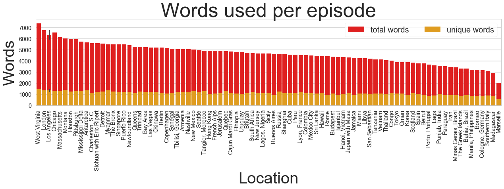
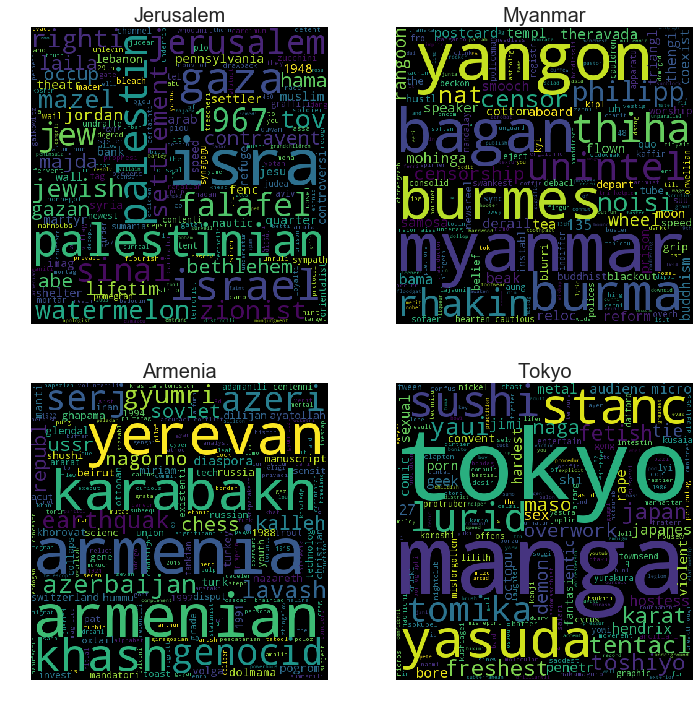
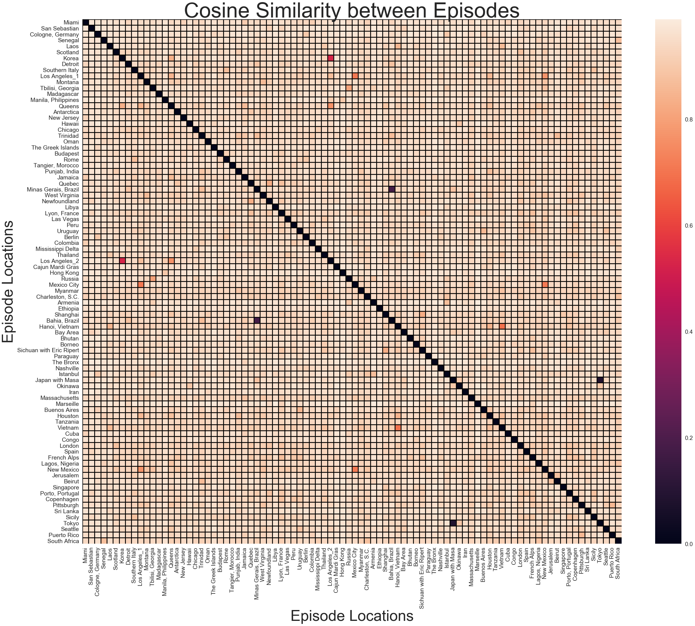
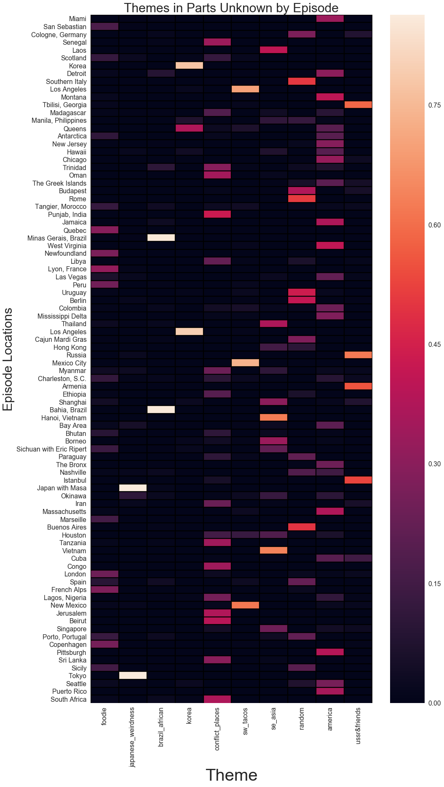
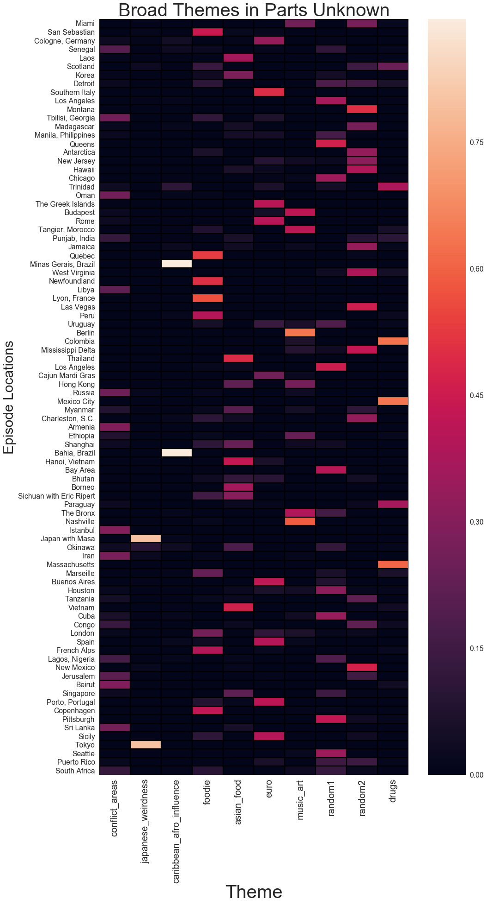
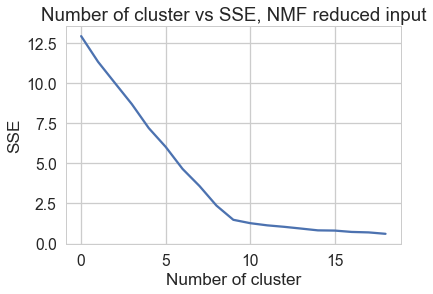
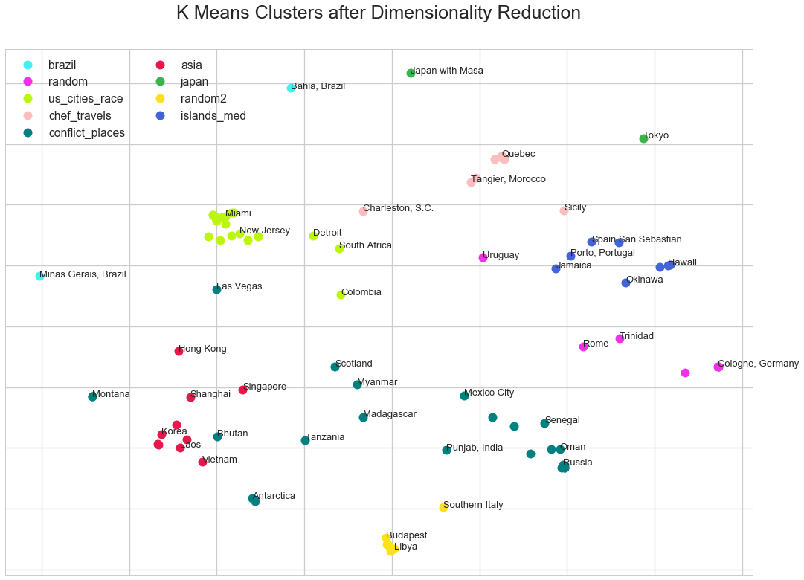
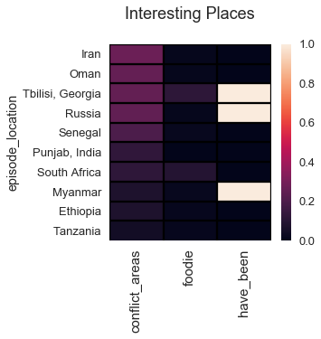

{}

Like many travelers I was saddened by the death of travel personality Anthony Bourdain. An ongoing (and ridiculous) theme that I espouse is insinuating that Bourdain 'stole' my travel destinations. "Pfffff, he **WOULD** go to Armenia," I complain. But in reality, I greatly valued the always interesting and wonderfully humanistic viewpoint that Bourdain presented while exploring the world's complex places. I'll miss this viewpoint terribly, and in this project I applied NLP and clustering tools to identify overarching themes in Bourdain's CNN series *Parts Unknown*. 

{}{}

## Data sources

I downloaded transcripts of the television show *Parts Unknown* from [OpenSubtitles](https://www.opensubtitles.org) and from [CNN](http://www.cnn.com/TRANSCRIPTS/abpu.html). Neither data source contained transcripts of all expisodes so I used both sources.

{}{}

## Data extraction and formatting

For the OpenSubtitle files I processed with a modified script [here](https://gist.github.com/ndunn219/62263ce1fb59fda08656be7369ce329b) (modifications saved in [`subtitle_lib`](https://github.com/katherinechandler/puk_nlp/tree/master/subtitle_lib) directory of this repo) and filtered the text to remove the intro theme song. For the CNN files, I used regex to remove narration indicators and a common 'transcript' words (things like 'translator' and 'voice-over') in these files.

The data processing and cleaning code can be found [here](https://github.com/katherinechandler/puk_nlp/blob/master/parts_unknown_nlp_full.ipynb). The raw and cleaned transcript text for 88 episodes was concatenated with additional metadata about each episode, including `episodeID`, `air_date`, and `episode_location`. You can find a csv of the full data set in the `processed_text` directory of my GitHub repo [here](https://github.com/katherinechandler/puk_nlp/blob/master/processed_text/puk_all_episodes.csv).

{}{}


{}{}

## Data import
In the interest of brevity here I'll just import the data as the cleaned csv.

{}{}

{}

```python
# common imports
import nltk
import os, os.path
import pandas as pd
import glob
import re
import numpy as np
import math

%matplotlib inline
import matplotlib.pyplot as plt
import seaborn as sns
```

{}

{}

```python
# import all concatenated data
puk = pd.DataFrame.from_csv('./puk_data/puk_all_episodes.csv')
```

{}

{}{}


{}

```python
# convert air_date as a date time object
puk.air_date = pd.to_datetime(puk.air_date)
```

{}

{}{}

## Tokenizers and stemming

{}{}

I used the `nltk.tokenize` tokenizer and the `PorterStemmer` for my text processing. I generated dictionaries of vocabulary containing the tokenized and stemmed the words in the `clean_text` field of the episode data frame. See [full notebook](https://github.com/katherinechandler/puk_nlp/blob/master/parts_unknown_nlp_full.ipynb) for additional code.

{}{}
{}

```python
# define stemmer and tokenizer

stemmer = PorterStemmer()

def stem_tokens(tokens, stemmer):
    stemmed = []
    for item in tokens:
        stemmed.append(stemmer.stem(item))
    return stemmed

def tokenize(text):
    tokens = nltk.word_tokenize(text.translate(translator))
    stems = stem_tokens(tokens, stemmer)
    return stems
```

{}

I examined the word usage in 'Parts Unknown' episodes and found that the episodes filmed in West Virginia, Los Angeles, and Montana have the highest number of unique words. I also noted that two episodes were filmed in Los Angeles (and have the same location name), thus the plot has an error bar. In general, though, the number of unique words used in each episode is fairly constant.

{}{}



{}{}

## Identifying and removing stopwords

{}{}

The `nltk stopwords` list of stop words is not comprehensive so I used several heuristics to identify additional stopwords. I defined 'common words' as tokens that occur in the corpus more than 880 times (average of 10 times per episode X 88 episodes). I added these words to the default `nltk stopwords` to create a corpus specific stopword list (`puk_stopwords`). I also removed words that were 1-2 characters in length. Again, see the [full notebook](https://github.com/katherinechandler/puk_nlp/blob/master/parts_unknown_nlp_full.ipynb) for code.

{}{}


    The Parts Unknown 'corpus' contains 14057 words
    The Parts Unknown 'corpus' contains 13933 words not in standard stopwords
    The Parts Unknown 'corpus' contains 13675 words not in specific stopwords


{}{}

## Exploring important words by episode

{}{}

Before I dug into more rigorous corpus-wide analysis, I wanted to explore the words used in a few of my favorite episodes. To do this I calculated term frequency–inverse document frequency (TF-IDF), a measure of word importance in a particular document relative to all the documents in that corpus. Below is a word cloud representation of the TF-IDF matrix of some of my favorite episodes. 

{}{}



It was striking to see how much of these essence of these places was captured simply by calculating TF-IDF. The words 'zionist', 'hamas', and 'falafel' are over represented in the Jerusalem episode, while the words 'censorship', 'tea', and 'mohinga' (a spicy fish soup) pretty much sum up Myanmar. The Armenian episode not only captures the conflict with Azerbaijan and the devestating 1992 earthquake, but touches on the country's obsession with chess. Japan, it seems, is mostly about 'porn', 'sushi', 'fetishes', and 'overwork'. 

{}{}

## Using cosine similarity to identify similar locations

{}{}

Examining an individual episode for important words isn’t that interesting, and I wanted to identify vocabulary similarities across episodes. One would expect, for example, that geographically or culturally related places like Southern Italy and Rome might contain a significant proportion of the same words.

To address this question I vectorized the data using `sklearn TfidfVectorizer`. The ` TfidfVectorizer ` converts a collection of documents to a matrix of TF-IDF features. From the transformed TF-IDF vector I calculated a cosine similarity matrix to measure vocabulary similarities between the episodes. Cosine similarity is a measure of the cosine of the angle between two non-zero vectors and is thus a measure of similarity. Identical vectors will have an angle of 0° and a cosine similarity score of cosine(0°) = 1. In practice, cosine similarity is often represented as distance = 1- cosine_similarity, thus identical vectors would have a distance of 0. I calculated the distance measure from the cosine similarity matrix and plotted the result on a heat map.

{}{}


{}

```python
from sklearn.feature_extraction.text import TfidfVectorizer, CountVectorizer
```

{}

{}{}


{}{}


{}

```python
# define data for the vectorizer and transformer functions
data = list(puk.clean_text)
episode_names = list(puk.episode_location)

# I need to address the fact that there are two LA episodes
episode_names[9] = 'Los Angeles_1'
episode_names[40] = 'Los Angeles_2'
```

{}

{}{}


{}

```python
# use tfidf vectorizer to vectorize and transform the data

tfidf_vectorizer = TfidfVectorizer(stop_words=set(puk_stopwords),
                                   smooth_idf=True,
                                   max_features=10000,
                                   max_df=60)

tfidf = tfidf_vectorizer.fit_transform(data)
```

{}

{}{}


{}

```python
from sklearn.metrics.pairwise import cosine_similarity
dist = 1 - cosine_similarity(tfidf)
```

{}

{}{}


{}

```python
# make df with distance scores mapped to episodes 

cosine_sim = pd.DataFrame(dist, episode_names)
cosine_sim.columns = episode_names
```

{}

{}{}


{}

```python
# Draw a heatmap with the numeric values in each cell

sns.set_context(context='poster', font_scale=1.2)

plt.subplots(figsize=(45,45))
ax = sns.heatmap(cosine_sim)
ax.hlines([range(len(cosine_sim))], *ax.get_xlim())
ax.vlines([range(len(cosine_sim))], *ax.get_ylim())
ax.set_xlabel('Episode Locations', size=30)
ax.set_ylabel('Episode Locations', size=30)
plt.title('Cosine Similarity between Episodes', size=45)
plt.setp(ax.get_xticklabels(), rotation=90)

plt.show()
```

{}




{}{}

The first thing that stands out with this heat map are the 4 strong purple points (dark purple represents a small distance between the episodes and thus higher similarity). Bourdain actually did two *Parts Unknown* episodes in Japan as well as two in Brazil, and not surprisingly these episodes use similar language. A number of other 'warm' spots were identified, and it's interesting to think about why Korea, LA, and Queens were identified as similar. 

To identify more unexpected connections between locations, I mapped the 3 most similar locations for each location using the cosine similarity score. While some of these associations didn't make sense, a surprising number of reasonable geographic and cultural/political relationships were identified.

For example, 'Southern Italy' was found to be related to Sicily (a region of Southern Italy), Rome (an Italian city), and Porto, Portugal (a southern European city). Regionally, these relationships make sense. 

Similarly, Russia was found to be most similar to Georgia, Armenia, and Istanbul. Russia, Georgia, and Armenia are all part of the former USSR, and Istanbul, Turkey is both geographically proximal and has an interconnected history with Armenia (which it borders) and Russia (a sometimes ally).

The Cuba episode was most similar to episodes located in Jamaica, Miami, and Hanoi, Vietnam. Cuba is geographically and culturally related to Jamaica and Miami, but the relationship with Hanoi, Vietnam is political. Both Cuba and Vietnam are socialist countries that have had conflicts with the United States, and Hanoi is the still the seat of the socialist party in Vietnam.

Below is a selection of interesting 'most related' locations.

{}{}


{}

```python
# create a list of the 3 most similar locations for each location
list_similar = []

for column in cosine_sim:
    most_similar = cosine_sim.nsmallest(4, column).index
    similar = (most_similar[0], 
               most_similar[1], 
               most_similar[2], 
               most_similar[3])
    list_similar.append(similar)
```

{}

{}{}


{}

```python
list_similar_df = pd.DataFrame.from_records(list_similar, 
                                            columns=['location',
                                            'similar_1',
                                            'similar_2',
                                            'similar_3'])
```

{}

{}{}


    Examples of Most similar locations based on cosine similarity of episode text:
    [['Korea' 'Los Angeles_2' 'Queens' 'Thailand']]
    [['Detroit' 'Bahia, Brazil' 'Minas Gerais, Brazil' 'Chicago']]
    [['Los Angeles_1' 'Mexico City' 'New Mexico' 'Queens']]
    [['Russia' 'Tbilisi, Georgia' 'Armenia' 'Istanbul']]
    [['Okinawa' 'Hawaii' 'Tokyo' 'Japan with Masa']]
    [['Southern Italy' 'Rome' 'Sicily' 'Porto, Portugal']]
    [['Laos' 'Hanoi, Vietnam' 'Vietnam' 'Thailand']]
    [['Miami' 'Jamaica' 'Colombia' 'Charleston, S.C.']]
    [['Cuba' 'Hanoi, Vietnam' 'Jamaica' 'Miami']]
    [['Hong Kong' 'Manila, Philippines' 'Shanghai' 'Hanoi, Vietnam']]


{}{}

## Modeling Topics with Non-negative Matrix Factorization (NMF)

{}{}

Now that I've identified some similiarities across the episode transcripts in the Parts Unknown corpus, I wanted to identify common themes. I used Non-negative Matrix factorization (NMF) to model theme clusters in the episodes of *Parts Unknown*. Below is a function to build a model and return the top `n` words for a given number of clusters `k` and for a transformed TF-IDF matrix. Much of the code is modified from [this](https://medium.com/ml2vec/topic-modeling-is-an-unsupervised-learning-approach-to-clustering-documents-to-discover-topics-fdfbf30e27df) hepful blog post.

{}{}


{}

```python
# get words from vectorizer and map back to NMF model 

from sklearn.decomposition import NMF

def get_nmf_topics(model, vectorizer, num_topics, n_top_words):
    
    feat_names = vectorizer.get_feature_names()
    
    n_top_words = -1 * n_top_words
    
    word_dict = {};
    for i in range(num_topics):
        
        #for each topic, obtain the largest values, 
        #and add the words they map to into the dictionary.
        words_ids = model.components_[i].argsort()[:n_top_words - 1:-1]
        words = [feat_names[key] for key in words_ids]
        word_dict['Theme # ' + '{:02d}'.format(i+1)] = words;
    
    return pd.DataFrame(word_dict)
```

{}

{}{}


{}{}


{}

```python
# generate a token dict with episode name as key

token_dict = {}

for idx, episode in puk.iterrows():
    episode_name = episode.episodeID
    text = episode.clean_text
    lowers = text.lower()
    no_punctuation = lowers.translate(string.punctuation)
    token_dict[episode_name] = no_punctuation
```

{}

{}{}


{}

```python
# use tfidf vectorizer to vectorize and transform the data

tfidf_vectorizer = TfidfVectorizer(tokenizer=tokenize, 
                                   stop_words=puk_stopwords,
                                   smooth_idf=False,
                                   max_features=10000,
                                   max_df=60,
                                   ngram_range=(1,3))

tfs = tfidf_vectorizer.fit_transform(token_dict.values())

# fit NMF model
model = NMF(n_components=10, init='nndsvd', random_state=42)

W = model.fit_transform( tfs )
H = model.components_

# get top 10 topics 
print('High TF-IDF Score Words by Theme:')
get_nmf_topics(model, tfidf_vectorizer, 10, 15)
```

{}

    Top 15 Words by Theme:


<div>
<style>
    .dataframe thead tr:only-child th {
        text-align: right;
    }

    .dataframe thead th {
        text-align: left;
    }

    .dataframe tbody tr th {
        vertical-align: top;
    }
</style>
<table border="1" class="dataframe">
  <thead>
    <tr style="text-align: right;">
      <th></th>
      <th>Theme # 01</th>
      <th>Theme # 02</th>
      <th>Theme # 03</th>
      <th>Theme # 04</th>
      <th>Theme # 05</th>
      <th>Theme # 06</th>
      <th>Theme # 07</th>
      <th>Theme # 08</th>
      <th>Theme # 09</th>
      <th>Theme # 10</th>
    </tr>
  </thead>
  <tbody>
    <tr>
      <th>0</th>
      <td>chef</td>
      <td>tokyo</td>
      <td>brazil</td>
      <td>korean</td>
      <td>beirut</td>
      <td>mexico</td>
      <td>vietnam</td>
      <td>berlin</td>
      <td>miami</td>
      <td>armenian</td>
    </tr>
    <tr>
      <th>1</th>
      <td>newfoundland</td>
      <td>sushi</td>
      <td>salvador</td>
      <td>korea</td>
      <td>africa</td>
      <td>mexican</td>
      <td>lao</td>
      <td>rome</td>
      <td>gon</td>
      <td>russia</td>
    </tr>
    <tr>
      <th>2</th>
      <td>lyon</td>
      <td>manga</td>
      <td>caipirinha</td>
      <td>han</td>
      <td>india</td>
      <td>new mexico</td>
      <td>vietnames</td>
      <td>itali</td>
      <td>detroit</td>
      <td>georgia</td>
    </tr>
    <tr>
      <th>3</th>
      <td>chocol</td>
      <td>yasuda</td>
      <td>brazilian</td>
      <td>seoul</td>
      <td>seneg</td>
      <td>taco</td>
      <td>noodl</td>
      <td>bueno air</td>
      <td>mississippi</td>
      <td>putin</td>
    </tr>
    <tr>
      <th>4</th>
      <td>basqu</td>
      <td>japanes</td>
      <td>african</td>
      <td>rockaway</td>
      <td>congo</td>
      <td>cartel</td>
      <td>hanoi</td>
      <td>cologn</td>
      <td>puerto</td>
      <td>armenia</td>
    </tr>
    <tr>
      <th>5</th>
      <td>chees</td>
      <td>stanc</td>
      <td>bahia</td>
      <td>queen</td>
      <td>oman</td>
      <td>trejo</td>
      <td>china</td>
      <td>uruguay</td>
      <td>bronx</td>
      <td>russian</td>
    </tr>
    <tr>
      <th>6</th>
      <td>marseil</td>
      <td>japan</td>
      <td>inaud</td>
      <td>game</td>
      <td>trinidad</td>
      <td>spanish</td>
      <td>hue</td>
      <td>bueno</td>
      <td>beach</td>
      <td>istanbul</td>
    </tr>
    <tr>
      <th>7</th>
      <td>quebec</td>
      <td>inaud</td>
      <td>world cup</td>
      <td>sizzler</td>
      <td>gaza</td>
      <td>gun</td>
      <td>rice</td>
      <td>roman</td>
      <td>chicago</td>
      <td>turkey</td>
    </tr>
    <tr>
      <th>8</th>
      <td>eric</td>
      <td>karat</td>
      <td>pellorinio</td>
      <td>koreatown</td>
      <td>african</td>
      <td>mescal</td>
      <td>singapor</td>
      <td>music</td>
      <td>island</td>
      <td>georgian</td>
    </tr>
    <tr>
      <th>9</th>
      <td>truffl</td>
      <td>tentacl</td>
      <td>capoeira</td>
      <td>kimchi</td>
      <td>palestinian</td>
      <td>topito</td>
      <td>thailand</td>
      <td>mussolini</td>
      <td>pittsburgh</td>
      <td>soviet</td>
    </tr>
    <tr>
      <th>10</th>
      <td>french</td>
      <td>sex</td>
      <td>detroit</td>
      <td>roy</td>
      <td>war</td>
      <td>drug</td>
      <td>chines</td>
      <td>german</td>
      <td>jamaica</td>
      <td>cha</td>
    </tr>
    <tr>
      <th>11</th>
      <td>franc</td>
      <td>japanes men</td>
      <td>cachaca</td>
      <td>choe</td>
      <td>masai</td>
      <td>chili</td>
      <td>war</td>
      <td>hungari</td>
      <td>mine</td>
      <td>polit</td>
    </tr>
    <tr>
      <th>12</th>
      <td>gon</td>
      <td>tie</td>
      <td>pelourinho</td>
      <td>halo</td>
      <td>south africa</td>
      <td>morrissey</td>
      <td>chili</td>
      <td>mardi</td>
      <td>montana</td>
      <td>toast</td>
    </tr>
    <tr>
      <th>13</th>
      <td>wine</td>
      <td>lurid</td>
      <td>blowfish</td>
      <td>gamer</td>
      <td>sri</td>
      <td>cowboy</td>
      <td>gon</td>
      <td>gon</td>
      <td>west virginia</td>
      <td>zamir</td>
    </tr>
    <tr>
      <th>14</th>
      <td>peru</td>
      <td>demon</td>
      <td>instrument</td>
      <td>bad korean</td>
      <td>indian</td>
      <td>chicano</td>
      <td>pork</td>
      <td>mardi gra</td>
      <td>heroin</td>
      <td>moscow</td>
    </tr>
  </tbody>
</table>
</div>


{}{}
I combed through the top words and high scoring locations for each identified theme, and named the themes based on what they most closely represent.

The collection of words in 'Theme 1' didn't make sense to me initially, but I explored the episodes with high 'Theme 1' scores and noticed that these were destinations that Bourdain visited with other chefs. The episodes filmed in Sichuan, Peru, Marseille, and the French Alps were filmed with his friend Eric Ripert; the Newfoundland and Quebec episodes feature the chef duo Dave McMillan and Fred Morin; and the episodes filmed in Copenhagen (with chef Alessandro Porcelli), Lyon (with Daniel Boulud), San Sebastian (with Juan Mari and Elena Arzak), and London (various chefs). Food words like 'truffle', 'wine', and 'chocolate' occur regularly, and food preparation features prominently. I termed this theme `'foodie'`.

Themes 2 (`'japanese_weirdness'`), 3 (`'brazil_african'`), and 4 (`'korea'`) are clearly related to Japan, Brazil, and Korea respectively. 

Theme 5 (`'conflict_places'`) appears to be related to places of heightened conflict, like Beirut, Gaza, and several African countries. 

Theme 6 (`'sw_tacos'`) represents Spanish-Mexican culture and is spread over many locations, including LA, Mexico City, Spain, Colombia, Houston, New Mexico. 

Theme 7 (`'se_asia'`) represents South East Asia in general and foods in particular, a Bourdain favorite. 

Theme 8 (`'random'`) has no discernable theme to me. 

Theme 9 (`'america'`) is loosely American. 

Theme 10 (`'ussr&friends'`) represents countries that were in the former USSR (Russia, Georgia, and Armenia) as well as culturally and geographically related neighbors (like Turkey and Iran).

After naming the NMF model themes, I plotted a heat map representing the mixture of themes in each episode location.

{}{}


{}

```python
# save topics to df with labels

topic_names = ['foodie', 'japanese_weirdness', 'brazil_african', 'korea', 
               'conflict_places','sw_tacos', 'se_asia', 'random', 
               'america', 'ussr&friends']

topics = get_nmf_topics(model, tfidf_vectorizer, 10, 15)
topics.columns = topic_names

# set up df of episode scores by topics

episode_locations = puk.episode_location
episode_scores = pd.DataFrame(W,index=episode_locations)
episode_scores.columns = topic_names

sns.set_context(context='talk', font_scale=1.2)

# Draw a heatmap with the numeric values in each cell
plt.subplots(figsize=(15,30))
ax = sns.heatmap(episode_scores)
ax.hlines([range(len(episode_scores))], *ax.get_xlim())
ax.vlines([range(20)], *ax.get_ylim())
ax.set_xlabel('Theme', size=40 )
ax.set_ylabel('Episode Locations', size=30)
plt.title('Themes in Parts Unknown by Episode', size=30)
plt.setp(ax.get_xticklabels(), rotation=90)

plt.show()
```

{}





{}{}

## Generalizing the NMF model

I noticed that lots of the 'top words' in the topics were proper nouns like places, languages, and ethnicities. To identify more general topics, I added countries, cities, regions, continents, nationalities, and languages to my list of stopwords. The lists containing this information can be found in the `supplemental_data` folder of this [repo](https://github.com/katherinechandler/puk_nlp). I combined all of these tokens into a list called `puk_stopwords_expanded`. 

{}{}


{}

```python
# combined expanded list of stopwords with a tokenized expanded stopwords

puk_stopwords_expanded = puk_place_stopwords + tokenized_place_stopwords
```

{}

{}{}


{}

```python
# generate new tf-idf vector using expanded stopword list

tfidf = TfidfVectorizer(tokenizer=tokenize,
                        stop_words=set(puk_stopwords_expanded),
                        smooth_idf=False,
                        max_features=10000,
                        max_df=60,
                        ngram_range=(1,4))

tfs = tfidf.fit_transform(token_dict.values())

# fit NMF model to tfs
model_themes = NMF(n_components=10, random_state=42)

W_themes = model_themes.fit_transform( tfs )

# get topic components

get_nmf_topics(model_themes, tfidf, 10, 15)
```

{}


<div>
<style>
    .dataframe thead tr:only-child th {
        text-align: right;
    }

    .dataframe thead th {
        text-align: left;
    }

    .dataframe tbody tr th {
        vertical-align: top;
    }
</style>
<table border="1" class="dataframe">
  <thead>
    <tr style="text-align: right;">
      <th></th>
      <th>Theme # 01</th>
      <th>Theme # 02</th>
      <th>Theme # 03</th>
      <th>Theme # 04</th>
      <th>Theme # 05</th>
      <th>Theme # 06</th>
      <th>Theme # 07</th>
      <th>Theme # 08</th>
      <th>Theme # 09</th>
      <th>Theme # 10</th>
    </tr>
  </thead>
  <tbody>
    <tr>
      <th>0</th>
      <td>war</td>
      <td>sushi</td>
      <td>caipirinha</td>
      <td>chef</td>
      <td>noodl</td>
      <td>yama</td>
      <td>music</td>
      <td>neighborhood</td>
      <td>water</td>
      <td>drug</td>
    </tr>
    <tr>
      <th>1</th>
      <td>putin</td>
      <td>yasuda</td>
      <td>inaud</td>
      <td>chocol</td>
      <td>rice</td>
      <td>wine</td>
      <td>record</td>
      <td>taco</td>
      <td>coal</td>
      <td>heroin</td>
    </tr>
    <tr>
      <th>2</th>
      <td>soviet</td>
      <td>stanc</td>
      <td>world cup</td>
      <td>truffl</td>
      <td>chili</td>
      <td>carniv</td>
      <td>artist</td>
      <td>tech</td>
      <td>mile</td>
      <td>cartel</td>
    </tr>
    <tr>
      <th>3</th>
      <td>gaddafi</td>
      <td>inaud</td>
      <td>pellorinio</td>
      <td>chees</td>
      <td>war</td>
      <td>tapa</td>
      <td>musician</td>
      <td>panther</td>
      <td>casino</td>
      <td>addict</td>
    </tr>
    <tr>
      <th>4</th>
      <td>polit</td>
      <td>karat</td>
      <td>capoeira</td>
      <td>cod</td>
      <td>beer</td>
      <td>mussolini</td>
      <td>film</td>
      <td>mom</td>
      <td>waffl</td>
      <td>violenc</td>
    </tr>
    <tr>
      <th>5</th>
      <td>sultan</td>
      <td>tentacl</td>
      <td>cachaca</td>
      <td>wine</td>
      <td>pork</td>
      <td>pig</td>
      <td>maya</td>
      <td>race</td>
      <td>cowboy</td>
      <td>mescal</td>
    </tr>
    <tr>
      <th>6</th>
      <td>hezbollah</td>
      <td>sex</td>
      <td>instrument</td>
      <td>wild</td>
      <td>spici</td>
      <td>mmm</td>
      <td>studio</td>
      <td>win</td>
      <td>nativ</td>
      <td>topito</td>
    </tr>
    <tr>
      <th>7</th>
      <td>revolut</td>
      <td>tie</td>
      <td>blowfish</td>
      <td>bladder</td>
      <td>squid</td>
      <td>cave</td>
      <td>writer</td>
      <td>truck</td>
      <td>barbecu</td>
      <td>madam</td>
    </tr>
    <tr>
      <th>8</th>
      <td>religi</td>
      <td>lurid</td>
      <td>music</td>
      <td>daniel</td>
      <td>longhous</td>
      <td>mardi</td>
      <td>butcher</td>
      <td>kimchi</td>
      <td>pheasant</td>
      <td>war drug</td>
    </tr>
    <tr>
      <th>9</th>
      <td>peac</td>
      <td>demon</td>
      <td>dend</td>
      <td>flavor</td>
      <td>karaok</td>
      <td>mardi gra</td>
      <td>gypsi</td>
      <td>store</td>
      <td>salad</td>
      <td>kill</td>
    </tr>
    <tr>
      <th>10</th>
      <td>conflict</td>
      <td>want kill</td>
      <td>dend oil</td>
      <td>fresh</td>
      <td>mmm</td>
      <td>porteño</td>
      <td>wall</td>
      <td>cub</td>
      <td>shoot</td>
      <td>father</td>
    </tr>
    <tr>
      <th>11</th>
      <td>optimist</td>
      <td>entertain</td>
      <td>oil</td>
      <td>classic</td>
      <td>blood</td>
      <td>tarantula</td>
      <td>band</td>
      <td>halo</td>
      <td>pig</td>
      <td>narco</td>
    </tr>
    <tr>
      <th>12</th>
      <td>women</td>
      <td>experi men</td>
      <td>cup</td>
      <td>cow</td>
      <td>bomb</td>
      <td>hmm</td>
      <td>cafe</td>
      <td>weed</td>
      <td>bond</td>
      <td>wahawka</td>
    </tr>
    <tr>
      <th>13</th>
      <td>toast</td>
      <td>tomika</td>
      <td>poison</td>
      <td>cream</td>
      <td>gawai</td>
      <td>godfath</td>
      <td>parti</td>
      <td>car</td>
      <td>public</td>
      <td>war</td>
    </tr>
    <tr>
      <th>14</th>
      <td>karabakh</td>
      <td>want kill want</td>
      <td>acaraj</td>
      <td>montreal</td>
      <td>iban</td>
      <td>saudad</td>
      <td>margo</td>
      <td>black</td>
      <td>access</td>
      <td>farc</td>
    </tr>
  </tbody>
</table>
</div>


{}{}

Removing place names from the vocabulary reveals general themes across the *Parts Unknown* corpus. Two location specific themes do emerge (Theme 2 is related to `'japanese_weirdness'` and Theme 3 is strongly Brazilian (`'caribbean_afro_influence'`). It is worth noting that in addition to distinctive cultures, both Japan and Brazil were featured in two episodes of *Parts Unknown* and are likely overrepresented in the data. This model also identified two seemingly random themes (Theme 8 and Theme 9). 

The remaining themes, however, are general and highlight overarching themes in *Parts Unknown*.

Theme 1 (`'conflict_areas'`) includes places of religious, political, and ideological tension. Episodes that score highly for this theme are Istanbul, Armenia, Beirut, Iran, and Sri Lanka. I find it interesting that in addition to the negative words associated with this theme, 'peace' and 'optimist' score highly in this topic.

Theme 4 (`'foodie'`) includes peaceful places where presumably Bourdain ate quite well. These episodes include Lyon (France), Quebec,  Newfoundland, and San Sebastian.

Theme 5 (`'asian_food'`) highlights Bourdain's love of Asian food, and is the only specific cuisine identified as a theme. I find it particularly satisfying that one of the top words for this category is 'mmm'. Locations scoring high for this theme are Thailand, Vietnam, Hong Kong and Singapore.

Theme 6 (`'euro'`) encompasses a span of European locations (and Buenos Aires, but hey, it's the Paris of South America). These top scoring locations are Southern Italy, Buenos Aires, Porto (Portugal) and the Greek Islands. 

Themes 7 (`'music_art'`) is a general theme of music and art. The geographic reach of this topic is broad, with top locations being Berlin (strong arts scene), Nashville (strong music scene) and Tangier, Morocco (home to a huge number of writers during the 1920-1950's 'interzone' period).

Theme 10 (`'drugs'`) encompasses places related to the drug trade or with a prevalent drug culture. These locations include Mexico City, Colombia, and Massachusetts (home of a major opioid crisis). 

Below is a heat map of how each location scores for each identified theme.

{}{}


{}{}


{}

```python
# save topics to df with labels

topic_names = ['conflict_areas', 'japanese_weirdness', 
               'caribbean_afro_influence', 'foodie', 'asian_food', 'euro',
               'music_art', 'random1', 'random2', 'drugs']

# fit NMF model to tfs
model_themes = NMF(n_components=10, random_state=42)

W_themes = model_themes.fit_transform( tfs )

# get topic components

get_nmf_topics(model_themes, tfidf, 10, 10)

# set up df of episode scores by topics

episode_locations = puk.episode_location
episode_scores = pd.DataFrame(W_themes,index=episode_locations)
episode_scores.columns = topic_names

sns.set_context(context='talk', font_scale=1.2)
# Draw a heatmap with the numeric values in each cell
plt.subplots(figsize=(15,30))
ax = sns.heatmap(episode_scores)
ax.hlines([range(len(episode_scores))], *ax.get_xlim())
ax.vlines([range(20)], *ax.get_ylim())
ax.set_xlabel('Theme', size=40 )
ax.set_ylabel('Episode Locations', size=30)
plt.title('Broad Themes in Parts Unknown', size=40)
plt.setp(ax.get_xticklabels(), rotation=90, size=20)

plt.show()
```

{}




{}{}

## Using NMF for Dimensionality Reduction and KMeans Clustering

{}{}

In the exploration above, I used a value of `k=10` to build an NMF model of 10 clusters. This `k` value was selected by experimenting with a range of `k` values and manually classifying sensible topics. This is a non-rigorous approach, but there is not a clean method to identify the 'optimal' cluster number for an NMF model. To more robustly validate the number of themes in the *Parts Unknown* corpus, I used the `sklearn.cluster KMeans` algorithm coupled with the 'elbow method'.

Like NMF, KMeans is an unsupervised clustering algorithm that is popular for text clustering and topic identification. While NMF is a linear algebraic method that represents data elements as a mixture of constituent vectors, KMeans is a quantization technique that partitions the data discretely into clusters. A KMeans model allows data elements to belong to only one cluster and the distance of each element to the associated cluster center (centroid) is a convenient way to score the model. 

The ‘elbow method’ is a commonly used approach to determine the appropriate number of clusters in a KMeans model, and entails calculating and plotting the sum of squared errors (SSE) for KMeans models over a range of `k` values. My initial elbow plot did not convergence at an elbow, meaning that the algorithm could not identify separate clusters in the raw data. A text corpus is a fairly high dimension space, and the Kmeans algorithm wasn’t dealing well with the [curse of dimensionality](https://en.wikipedia.org/wiki/Curse_of_dimensionality).  

To address this issue, I used the NMF theme matrix as input for a KMeans model (rather than the vectorized TF-IDF matrix). This approach massively reduced dimensionality since each document was represented as a mixture of 10 themes rather than a collection of 10,000 TF-IDF scores. Using this approach, the elbow method identified `k=9` as the best number of topics (lowest SSE, see [parts_unknown_nlp_full.ipynb](https://github.com/katherinechandler/puk_nlp/blob/master/parts_unknown_nlp_full.ipynb) for all elbow plots).

{}{}

{}

```python
from sklearn.cluster import KMeans
```

{}


{}

```python
#  elbow plots using NMF for dimensionality reduction
num_clusters  = range(1, 20)

km = [KMeans(n_clusters=i) for i in num_clusters]

sse_test = {}

for i in range(len(km)):
    kmeans = km[i].fit(W_themes)
    sse_test[i] = kmeans.inertia_ 

plt.figure()
plt.plot(list(sse_test.keys()), list(sse_test.values()))
plt.title("Number of cluster vs SSE, NMF reduced input")
plt.xlabel("Number of cluster")
plt.ylabel("SSE")
plt.show()
```

{}





{}{}

{}{}

{}{}

After identifying the appropriate number of clusters, I built a KMeans model and explored the episodes associated with each cluster. Because these clusters were built on the NMF matrix and not the TF-IDF matrix, there is no list of significant words to illuminate connections between the elements in the cluster. I developed cluster names based on my knowledge of the episode locations, but these connections are less compelling to me than the broad NMF model themes.

{}{}

{}

```python
# Using num_clusters identified in elbow method, NMF matrix input

num_clusters = 9

km = KMeans(n_clusters=num_clusters, random_state=42)

km.fit(W_themes)

clusters = km.labels_.tolist()
```

{}

{}{}


{}{}


{}

```python
# dictionary and df of episode identifiers

episodes = {'episodeID': list(puk.episodeID), 
            'episode_location': list(puk.episode_location), 
            'date': list(puk.air_date), 
            'cluster': clusters}

frame = pd.DataFrame(episodes, index = [clusters] , 
                     columns = ['episodeID', 'episode_location', 
                                'date', 'cluster'])
```

{}

{}{}


{}

```python
# print episodes in each cluster; code adapted from: 
# http://brandonrose.org/clustering#Tf-idf-and-document-similarity

#sort cluster centers by proximity to centroid
order_centroids = km.cluster_centers_.argsort()[:, ::-1] 

for i in range(num_clusters):
    episode_list = []
   
    for episode in frame.loc[i]['episode_location']:
        episode_list.append(episode)
    print("Cluster {} episodes, {} episodes:  ".format(i, len(episode_list)))
    print(', '.join(episode_list))

    print('') #add whitespace
    print('') #add whitespace
```

{}

    Cluster 0 episodes, 2 episodes:  
    Minas Gerais, Brazil, Bahia, Brazil
    
    Cluster 1 episodes, 7 episodes:  
    Cologne, Germany, Manila, Philippines, Trinidad, Rome, Uruguay, 
    Cajun Mardi Gras, Buenos Aires
    
    Cluster 2 episodes, 19 episodes:  
    Miami, Detroit, Los Angeles, Queens, New Jersey, Chicago, Berlin, Colombia, 
    Mississippi Delta, Los Angeles, Bay Area, The Bronx, Nashville, Massachusetts, 
    Houston, Cuba, Pittsburgh, Seattle, South Africa
    
    Cluster 3 episodes, 11 episodes:  
    Tangier, Morocco, Quebec, Newfoundland, Lyon, France, Peru, Charleston, S.C., 
    Marseille, London, French Alps, Copenhagen, Sicily
    
    Cluster 4 episodes, 23 episodes:  
    Senegal, Scotland, Montana, Tbilisi, Georgia, Madagascar, Antarctica, Oman, 
    Punjab, India, West Virginia, Las Vegas, Russia, Mexico City, Myanmar, 
    Armenia, Bhutan, Istanbul, Iran, Tanzania, Lagos, Nigeria, New Mexico, 
    Jerusalem, Beirut, Sri Lanka
    
    Cluster 5 episodes, 10 episodes:  
    Laos, Korea, Thailand, Hong Kong, Shanghai, Hanoi, Vietnam, Borneo, 
    Sichuan with Eric Ripert, Vietnam, Singapore
    
    Cluster 6 episodes, 2 episodes:  
    Japan with Masa, Tokyo
    
    Cluster 7 episodes, 6 episodes:  
    Southern Italy, Budapest, Libya, Ethiopia, Paraguay, Congo
    
    Cluster 8 episodes, 8 episodes:  
    San Sebastian, Hawaii, The Greek Islands, Jamaica, Okinawa, Spain, Porto, 
    Portugal, Puerto Rico
    
    


{}{}


{}{}

## Plotting K means model clusters

{}{}

After naming the location clusters generated by the KMeans model I plotted the model. The plotting code below is adapted from this [blog](http://brandonrose.org/clustering#Tf-idf-and-document-similarity). 

{}{}


{}

```python
from sklearn.manifold import MDS

# make 2-d matrix for plotting

dist = 1 - cosine_similarity(W_themes)

MDS()

# convert two components as we're plotting points in a two-dimensional plane
# "precomputed" because we provide a distance matrix
# we will also specify `random_state` so the plot is reproducible.

mds = MDS(n_components=2, dissimilarity="precomputed", random_state=1)

pos = mds.fit_transform(dist)  # shape (n_components, n_samples)

xs, ys = pos[:, 0], pos[:, 1]
```

{}

{}

```python
#set up colors per clusters 
cluster_colors = {0: '#46f0f0', 1: '#f032e6', 2: '#bcf60c', 3: '#fabebe', 
                  4: '#008080', 5:'#e6194b', 6:'#3cb44b', 7:'#ffe119', 
                  8:'#4363d8'}

#set up cluster namest
cluster_names = {0:'brazil',
                 1:'random',
                 2:'us_cities_race',
                 3:'chef_travels',
                 4:'conflict_places', 
                 5:'asia',
                 6:'japan',
                 7:'random2',
                 8:'islands_med'}
```

{}

{}{}


{}

```python

# MDS results plus the cluster numbers and names
df = pd.DataFrame(dict(x=xs, y=ys, label=clusters, 
                  title=list(puk.episode_location))) 

# group by cluster
groups = df.groupby('label')

# set up plot
fig, ax = plt.subplots(figsize=(17, 9)) # set size
ax.margins(0.05) # Optional, just adds 5% padding to the autoscaling

# iterate over groups to layer the plot
# use the cluster_name and cluster_color dicts with the 'name' lookup to 
# return the appropriate color/label
for name, group in groups:
    ax.plot(group.x, group.y, marker='o', linestyle='', ms=12, 
            label=cluster_names[name], color=cluster_colors[name], 
            mec='none')
    ax.set_aspect('auto')
    ax.tick_params(\
        axis= 'x',          # changes apply to the x-axis
        which='both',      # both major and minor ticks are affected
        bottom='off',      # ticks along the bottom edge are off
        top='off',         # ticks along the top edge are off
        labelbottom='off')
    ax.tick_params(\
        axis= 'y',         # changes apply to the y-axis
        which='both',      # both major and minor ticks are affected
        left='off',      # ticks along the bottom edge are off
        top='off',         # ticks along the top edge are off
        labelleft='off')
    
ax.legend(numpoints=1, loc="upper left", ncol=2)  #show legend with only 1 pt

# mask overlapping labels (means you lose some labels)

ann = []
for i in range(len(df)):
    ann.append(ax.annotate(df.iloc[i]['title'], xy = (df.iloc[i]['x'], 
    df.iloc[i]['y']), size=13))

mask = np.zeros(fig.canvas.get_width_height(), bool)

fig.canvas.draw()

for a in ann:
    bbox = a.get_window_extent()
    x0 = int(bbox.x0)
    x1 = int(math.ceil(bbox.x1))
    y0 = int(bbox.y0)
    y1 = int(math.ceil(bbox.y1))

    s = np.s_[x0:x1+1, y0:y1+1]
    if np.any(mask[s]):
        a.set_visible(False)
    else:
        mask[s] = True  
        
plt.title("K Means Clusters after Dimensionality Reduction")
plt.show()
```

{}




{}{}


{}{}

Compared to the clusters generated from the KMeans model without dimensionality reduction (data not shown, see [here](https://github.com/katherinechandler/puk_nlp/blob/master/parts_unknown_nlp_full.ipynb) ) these clusters are well defined and refect largely similar locations. The NMF model, however, is a better fit for this type of 'mixed theme' problem. Each episode may contain many significant themes, and KMeans model doesn't represent that. It turns out that for this problem we want a 'soft' clustering algorithm like NMF, not a 'hard' clustering algorithm like KMeans.

{}{}

{}{}

## So what’s it all about, Tony???

*Parts Unknown* is frequently described as a ‘food show’, but it’s more than that. Yes, there is a strong food theme (Asian and otherwise) in these models, but this analysis shows what most fans of *Parts Unknown* inherently knew. The show is not *only* about food, but is an exploration of the human experience and the forces that shape the world we live in. 

As discussed above, the generalized NMF model best describes the essence of the *Parts Unknown* corpus. Sifting through the significant words and the episode scores by theme, the range of these themes emerges.  The ‘conflict_areas’ theme explores broad themes of war and political uncertainty, ranging from Putin’s Russia to the politics of Hezbollah to ethnic conflict in Sri Lanka. The ‘music_art’ theme touches on emerging music scenes, the work of authors like William Faulkner and William S. Burrows, and the influence of gentrification on the arts. The ‘drugs’ theme adresses addiction and links seemingly disparate places like Colombia, Massachusetts, and Morocco. Uncovering connections between places that seem unrelated is why I travel, and it’s something Bourdain did uniquely well.

So what’s it all about? War, politics, music, literature, mind altering substances, and yeah, Asian street food too. Its kind of about... everything.

{}{}

## And now some fun planning my next vacation: the conflict-foodie index

{}{}

>###  “I usually try to avoid clean, orderly countries without massive social problems.” 
>###    -Anthony Bourdain

I couldn't agree more. Clean countries are boring (except Japan), orderly countries are boring (except Japan), and massive social problems often stem from cultural complexity. In this vein, I used the themes I uncovered in *Parts Unknown* to identify place I'd like to go. While I like conflict zones, I also like to eat, so I defined `interesting_places` as those that had non-zero scores for the `conflict_area` theme and the `foodie` theme. Below I plotted a heat map of the top `interesting_places` correlated with whether or not I have already visited (1= have been, 0= have not been). 

As per my strong suspicions, my next travel destination should be Iran, or possibly Oman (which I hear has some glamping opportunities). As always, Tony, thank you for the insight, and for encouraging people like me to venture forth and explore the big scary world.

{}{}


{}

```python
# add my travel data to the episode scores data

combined_data = pd.merge(episode_scores, puk, left_index=True, 
                         right_on='episode_location')
                         
combined_data = combined_data[list(episode_scores.columns) + 
                             ['episode_location', 'j_j']]
                             
combined_data.columns = list(combined_data.columns[:-1]) + ['have_been']

combined_data.set_index('episode_location', inplace=True)
```

{}

{}{}


{}

```python
# the foodie topic index

interesting_places = (combined_data[['conflict_areas', 'foodie', 'have_been']]
                      [(combined_data.conflict_areas != 0)&
                      (combined_data.foodie !=0)]).sort_values(by=
                                                         ['conflict_areas', 
                                                         'foodie'], 
                                                         ascending=False
                                                         ).head(n=10)
```

{}

{}{}


{}

```python
# convert Y/N to int

mapping = {'Y': 1, 'N': 0}
interesting_places = interesting_places.applymap(lambda s: mapping.get(s) if s 
                                                 in mapping else s)
```

{}

{}{}


{}

```python
sns.set_context(context='talk', font_scale=1)
plt.figure(figsize=(4,4))
ax = sns.heatmap(interesting_places)
ax.hlines([range(len(interesting_places))], *ax.get_xlim())
ax.vlines([range(10)], *ax.get_ylim())
plt.title('Interesting Places', size=18, y=1.1)
plt.ylabel = ("Location")
plt.setp(ax.get_xticklabels(), rotation=90, size=15)

plt.show()
```

{}



{}{}